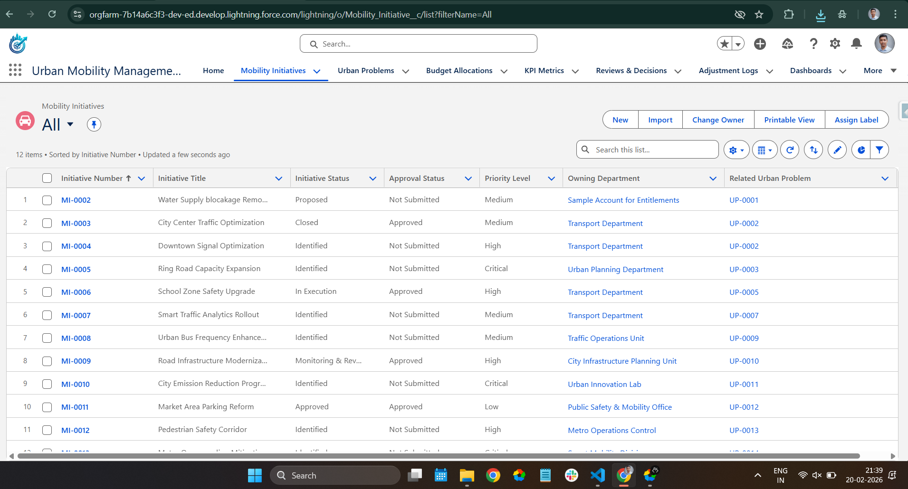
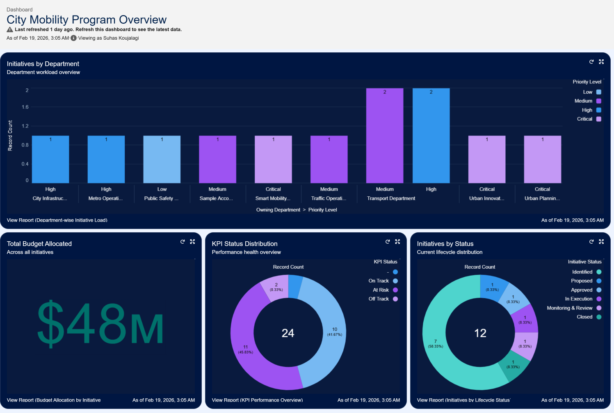
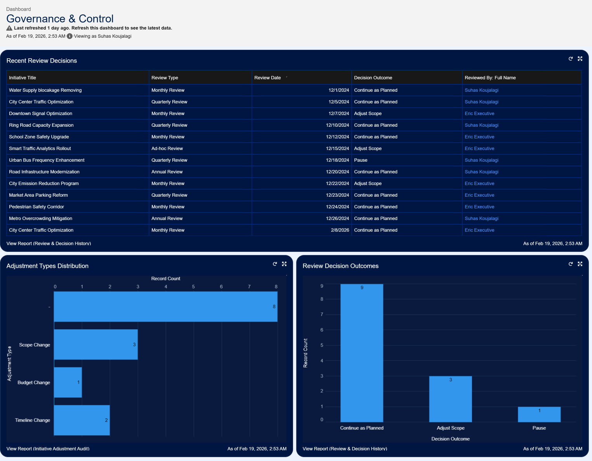
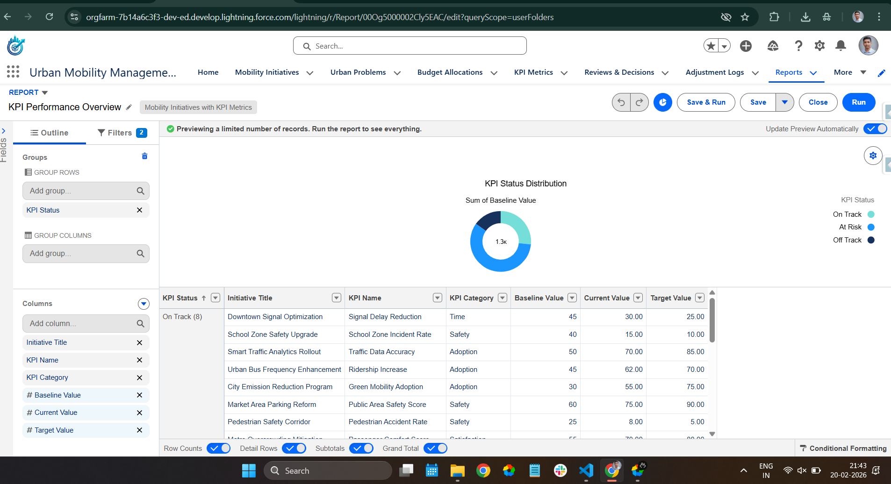

# Urban Mobility Initiative Management System

## 1. Overview

The Urban Mobility Initiative Management System is a Salesforce-based governance and execution tracking platform designed to manage city-level mobility initiatives from problem identification to measurable outcome evaluation.

The system provides structured tracking for initiative planning, funding allocation, KPI monitoring, citizen feedback campaigns, review decisions, and controlled adjustments within a unified Lightning application.

The solution design is inspired by an urban mobility ***case study from the McKinsey.org Forward 2025 program.***

The current implementation is built using Salesforce’s declarative capabilities (data modeling, automation, validation rules, reporting, dashboards, and UI configuration). The system architecture is designed to be extended through a development layer, including Lightning Web Components and advanced customization.

## 2. System Architecture

The system follows a centralized governance model where **Mobility Initiative** acts as the core operational entity. Each initiative is owned by a Department (Account) and serves as the anchor point for funding, performance tracking, citizen engagement, and governance review.

### Architecture Overview 
```
                         ┌────────────────────────┐
                         │     City Leadership    │
                         │ (Dashboards & Reports) │
                         └──────────────▲─────────┘
                                        │
                                   KPIs / Insights
                                        │
                         ┌────────────────────────┐
                         │     Department         │
                         │      (Account)         │
                         └──────────────▲─────────┘
                                        │
                         ┌────────────────────────┐
                         │  Mobility Initiative   │
                         │         (CORE)         │
                         └──────────────▲─────────┘
                                        │
        ┌───────────────┬──────────────┼───────────────┬───────────────┐
        │               │              │               │               │
┌──────────────┐ ┌──────────────┐ ┌──────────────┐ ┌──────────────┐ ┌──────────────┐
│ Urban        │ │ Budget       │ │ KPI Metrics  │ │ Campaign     │ │ Reviews &    │
│ Problem      │ │ Allocation   │ │              │ │              │ │ Decisions    │
│ (WHY)        │ │ (Funding)    │ │ (Performance)│ │ (Feedback)   │ │ (Governance) │
└──────────────┘ └──────────────┘ └──────────────┘ └──────▲───────┘ └──────▲───────┘
                                                           │                │
                                                   ┌──────────────┐  ┌──────────────┐
                                                   │ Campaign     │  │ Adjustment   │
                                                   │ Member       │  │ Log (Audit)  │
                                                   │ (Responses)  │  └──────────────┘
                                                   └──────────────┘
```

## 3. System Implementation (Declarative Layer)

The current implementation is built using Salesforce declarative configuration, combining structured data modeling, validation controls, automation, reporting, and dashboard analytics.

### Data Model

The system is centered on the Mobility Initiative object. Each initiative:

- Is owned by a Department (Account)
- Is linked to an Urban Problem
- Tracks Budget Allocations
- Tracks KPI Metrics
- Supports Reviews & Decisions
- Maintains Adjustment Logs for review actions
- Connects to Campaigns for structured feedback collection

All relationships are implemented using Lookup fields to maintain flexibility while preserving linkage between planning, funding, execution, and review components.

### Validation Controls

Validation rules enforce required data before lifecycle transitions. These controls ensure:

- Mandatory planning data is captured at proposal stage
- Required approval attributes are present before execution
- Status progression aligns with defined governance checkpoints

### Automation

Record-triggered flows manage:

- Lifecycle status transitions
- Blocking execution when budget is missing
- Blocking review when KPI metrics are not defined
- Automatic feedback campaign creation during review cycles
- Ownership reassignment based on lifecycle stage

Automation ensures consistent operational behavior across initiative records.

### Reporting & Dashboards

Custom reports provide structured analytical views including:

- Budget allocation by initiative
- Department-wise initiative load
- KPI performance tracking
- Initiative lifecycle status distribution
- Review decision history
- Adjustment audit records

Dashboards consolidate these reports using multiple visualization types such as `donut charts`, `vertical bar charts`, `horizontal graphs`, `matrix reports`, and `tabular views`. These dashboards provide clear **distribution of initiative load, total allocated budgets, KPI status breakdown, and governance activity trends.**

### Data Management

Initial data setup and structured record loading were performed using Salesforce Data Loader and the Data Import Wizard to support testing, reporting validation, and dashboard verification.

## 4. System Preview

### Application Overview

The Urban Mobility Management Lightning Application centralizes initiative tracking, governance reviews, funding visibility, KPI monitoring, and campaign-based feedback collection within a structured navigation model.

<div align="center">  </div>

### Executive & Governance Dashboards

Dashboards provide consolidated analytical views across funding, lifecycle distribution, KPI performance, and departmental initiative load. Multiple chart types are used to present structured breakdowns for operational and leadership monitoring.

<div align="center">   </div>

### Sample Analytical Report

Structured reports support budget analysis, KPI tracking, lifecycle monitoring, and audit-level governance visibility.

<div align="center">  </div>

## 5. Development & Application Extensions

**⚠️Note:** This section will expand as development components are introduced.

The development layer extends the existing declarative foundation through deeper application customization, advanced process handling, structured approval mechanisms, and enhanced user interaction where required.

Future additions in this section will focus on extending system capability beyond configuration-level controls while maintaining architectural consistency with the existing implementation.